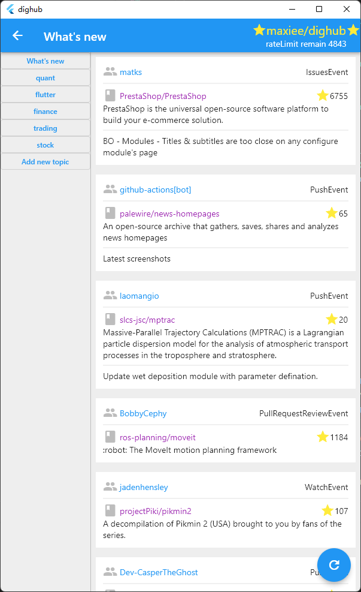
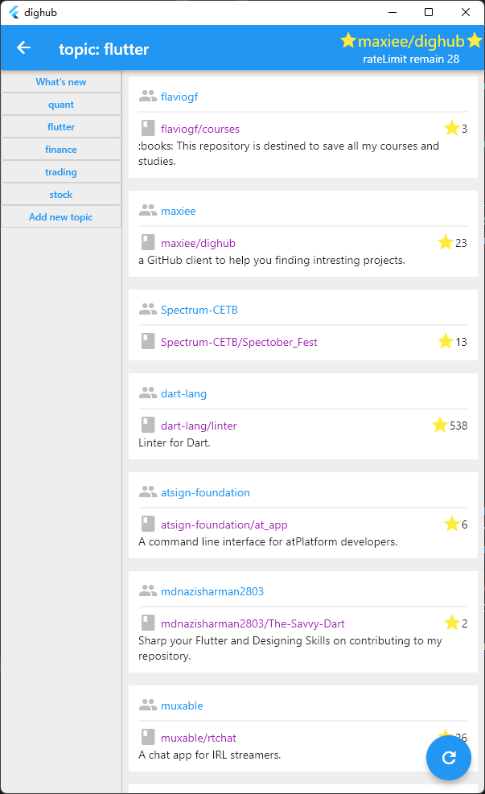
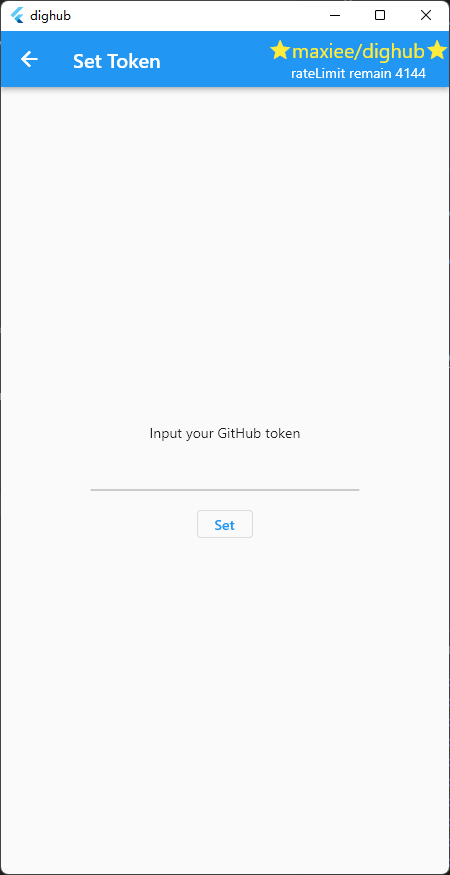

# dighub

DigHub is a GitHub client to help you finding intresting projects.

It's based on the GitHub API's events interface, which gives you real-time access to what's going on across GitHub.

It will also automatically filter out star 0 projects for you to help you focus on higher value projects.

Note that you need to fill in your GitHub Token to ensure that the tool sends requests within the API limit (5k requests per hour with Token).

**Your Token will only be used locally. DigHub is free software, under the GPLv3 license, and will not capture any of your privacy for upload.**

To save API overhead, data is cached on disk. Remember to delete this database to free up disk space when you no longer use this tool.

The tool is currently developed for Windows desktop systems and should work out of the box on other desktop systems and Android and iOS mobile devices as well. If you encounter problems running it on other platforms, feel free to give feedback.

## Screenshot

|What's New|Topic|
|---|---|
|See what's going on across GitHub|Subscribe your favoriate topic|
|||
|**Input Token**||
|You need to fill in your GitHub Token to use dighub **Your Token will only be used locally.**||
|||